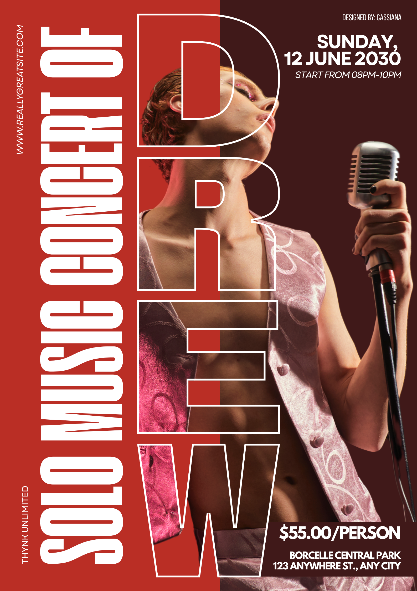

# Cassandra Miranda — Portfolio

Plain HTML/CSS/JS site. No build step, no framework — works as-is on GitHub Pages or Vercel.

## Files
```
index.html        → all the content/sections
style.css          → all the styling (colors, fonts, layout, effects)
script.js          → mobile menu, gallery filters, scroll effects, footer year
assets/
  favicon.png                → browser tab icon + nav logo
  posters/                   → poster images (c1.png – c6.png)
  thumbnails/                → thumbnail images (t1.png – t12.png)
  ai-generated-images/       → AI-generated images (ai1.png – ai18.png)
  ai-generated-videos/       → AI-generated videos (.mp4 files)
```

## 1. Add your real images and videos
Each gallery item in `index.html` points to a file, for example:
```html

```
```html
<video src="assets/ai-generated-videos/v1.mp4" ...></video>
```
Drop your file into the matching folder using the filename already referenced in the
code (`c1.png`, `t10.png`, `ai7.png`, `v1.mp4`, etc.), or change the `src` path to
whatever you name your file. Until a real file is added, that card shows an
"Add [filename]" placeholder automatically — nothing breaks.

To add more gallery items, copy one `<figure class="card" data-cat="...">...</figure>`
block and paste it, changing the file path, category (`poster`, `thumbnail`, `ai`, or
`video`), and caption. A card can belong to more than one category by space-separating
values in `data-cat` (e.g. `data-cat="thumbnail ai"`).

## 2. Push to GitHub
```bash
cd portfolio
git init
git add .
git commit -m "Initial portfolio"
git branch -M main
git remote add origin https://github.com/<your-username>/<your-repo>.git
git push -u origin main
```
(Create the empty repo on GitHub first if you haven't — no README/license, just an empty repo — then run the commands above.)

To add new files later (images, videos, edits), it's just:
```bash
git add .
git commit -m "Add new work"
git push
```
Or upload directly through GitHub's web interface: open the repo → the right folder
inside `assets/` → **Add file → Upload files** → drag your files in → commit.

## 3. Connect to Vercel
- Go to vercel.com → **Add New Project** → import the GitHub repo.
- Framework preset: **Other** (it's static HTML, no build command needed).
- Root directory: leave as `/` (or point to this `portfolio` folder if it's nested in a bigger repo).
- Click **Deploy**. Every future push to `main` auto-deploys.

## 4. After it's live
- Add your custom domain (if any) under Vercel → Project → Settings → Domains.
- To update content, just edit the files and `git push` — Vercel redeploys automatically.

## Gallery filters
The Work section has five filters: **All**, **Posters**, **Thumbnails**,
**AI Generated Images**, and **AI Generated Videos**. Selecting "AI Generated Videos"
switches the gallery to a 4-column layout suited to vertical (9:16) clips; every other
filter uses the standard 3-column grid.

## Notes
- Colors, fonts, and layout all live in `style.css` under the `:root` section at the top —
  change the hex values there to retheme the whole site at once.
- The Instagram and LinkedIn links open in a new tab; email opens the visitor's mail app.
- Only one gallery video plays at a time — starting a new one automatically pauses any others.
- Effects (scroll reveal, custom cursor, card glow, letter animation, etc.) automatically
  scale back for visitors with "reduce motion" enabled, and the custom cursor disables
  itself on touch devices.
